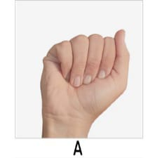

# 🤟 Speech to Sign Language

[](https://speech-to-sign-language-nine.vercel.app/)

🌐 **Live App:** [https://speech-to-sign-language-nine.vercel.app/](https://speech-to-sign-language-nine.vercel.app/)

A web application that converts **speech or text** into **Indian Sign Language (ISL)** hand sign images — supporting English, Hindi, and Marathi.



---

## ✨ Features

- 🎤 **Speech Recognition** — Speak in English, Hindi, or Marathi
- ✏️ **Text Input** — Type any sentence manually
- 🌐 **Auto Translation** — Hindi & Marathi are automatically translated to English
- 🤲 **Hand Sign Display** — Each letter shown as an ISL hand sign image
- 📖 **Word Spacing** — Visual gaps between words for easy reading
- 💜 **Soft Pastel UI** — Clean, modern, split-panel design

---

## 🛠️ Tech Stack

| Layer | Technology |
|---|---|
| Backend | Python, Flask |
| Translation | Google Translate (`googletrans`) |
| Image Processing | Pillow (PIL) |
| Frontend | HTML, CSS, Vanilla JS |
| Speech Input | Web Speech API (browser-native) |

---

## 🚀 Getting Started

### 1. Clone the repository
```bash
git clone https://github.com/SaniyaNirmale/speech-to-sign-language.git
cd speech-to-sign-language
```

### 2. Install dependencies
```bash
pip install flask googletrans==4.0.0rc1 Pillow
```

### 3. Run the app
```bash
python app.py
```

### 4. Open in browser
```
http://127.0.0.1:5000
```

> ⚠️ Speech recognition requires **Google Chrome** (uses the Web Speech API)

---

## 📁 Project Structure

```
speech-to-sign-language/
│
├── app.py                  # Flask backend
├── templates/
│   └── index.html          # Main UI
├── static/
│   ├── styles.css          # Styling
│   ├── script.js           # Frontend logic
│   └── hand_signs/         # A-Z sign images (PNG)
│       ├── A.png
│       ├── B.png
│       └── ...
└── requirements.txt
```

---

## 🌐 Supported Languages

| Language | Speech Input | Auto-translated to English |
|---|---|---|
| English | ✅ | — |
| Hindi | ✅ | ✅ |
| Marathi | ✅ | ✅ |

---

## 📸 Screenshots

> Split-panel layout — inputs on the left, hand signs on the right.

---

## 🙌 Author

**Saniya Nirmale**  
[GitHub](https://github.com/SaniyaNirmale)
